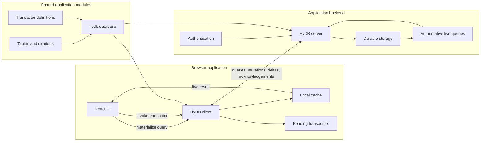
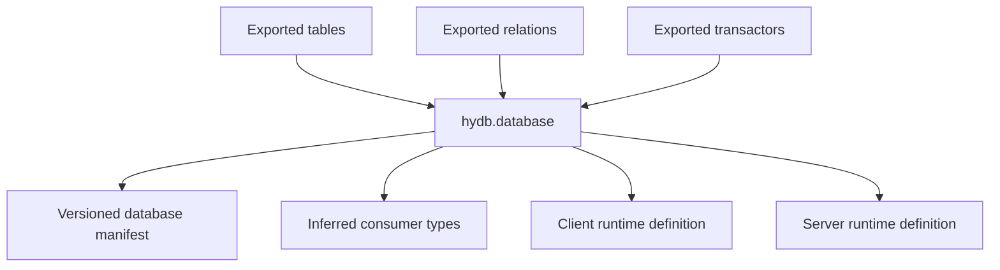
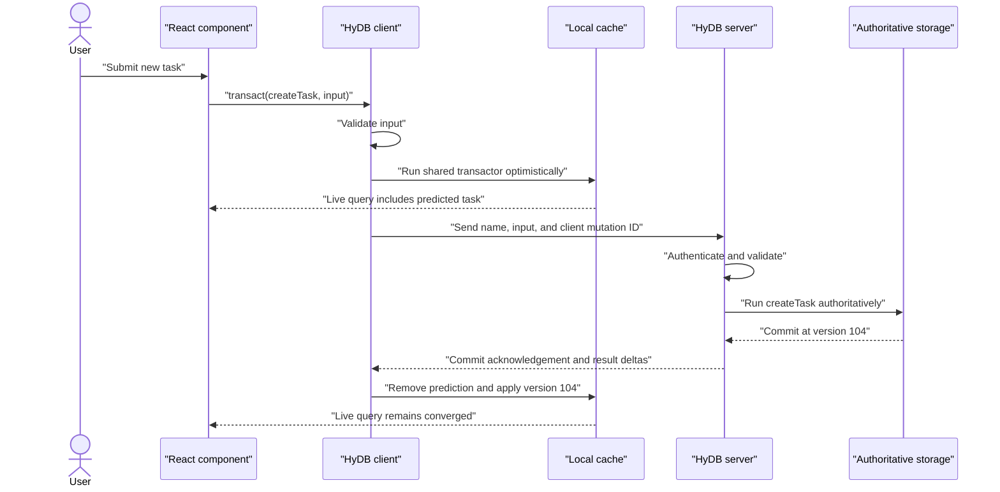
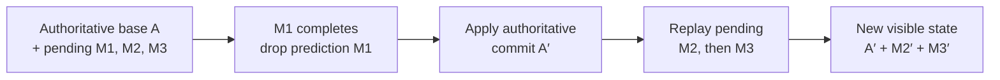
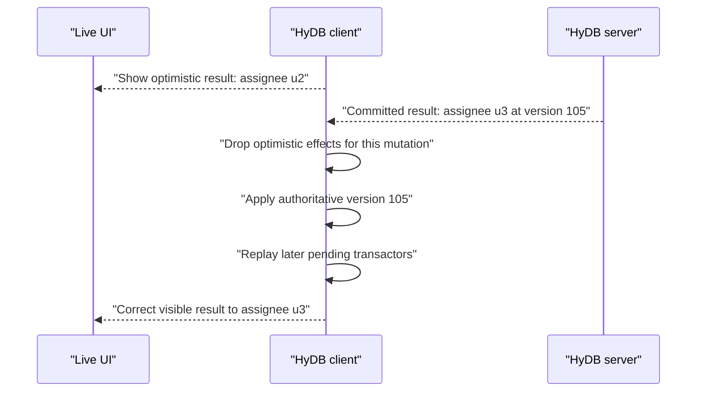
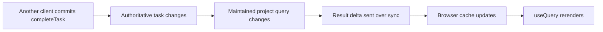
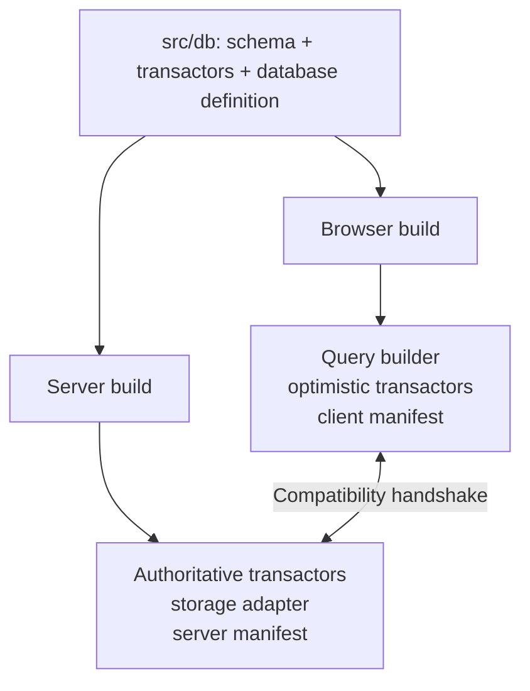

# Building an Application with HyDB

Status: Working architecture example

This document demonstrates how an application would be organized and built using the consumer API proposed in [api-spec.md](./api-spec.md). It uses a collaborative project manager with projects, tasks, and users as the running example.

The example focuses on application structure and data flow. HyDB’s differential execution internals are not exposed to application code.

## What the application gets from HyDB

The finished application has:

- Typed schema definitions shared across the codebase.
- Declarative frontend queries that update automatically.
- Named transactors that run optimistically in the browser.
- Authoritative validation and execution on the backend.
- Persistent local data for fast startup and temporary offline use.
- Reconciliation when authoritative results differ from predictions.
- One set of domain rules for browser interactions, API requests, jobs, and tests.

## System architecture



The browser and backend import the same database definition. They do not have equal authority:

- The browser predicts results for responsiveness.
- The backend authenticates, validates, commits, and determines the authoritative result.

## Project structure

```text
project-manager/
  package.json
  src/
    db/
      schema/
        users.ts
        projects.ts
        tasks.ts
        relations.ts
        index.ts
      transactors/
        projects.ts
        tasks.ts
        index.ts
      database.ts

    client/
      database.ts
      App.tsx
      components/
        ProjectPage.tsx
        TaskList.tsx
        CreateTaskForm.tsx

    server/
      database.ts
      auth.ts
      main.ts

    jobs/
      import-tasks.ts

  test/
    transactors/
      tasks.test.ts
    sync/
      task-reconciliation.test.ts
```

The `db` directory contains portable application definitions. It must not import browser-only or server-only modules.

## 1. Define tables by domain

Tables are standalone exports rather than properties of one schema object.

```ts
// src/db/schema/users.ts
import {
  defineTable,
  id,
  string,
  timestamp,
  uniqueIndex,
} from 'hydb/schema'

export const users = defineTable(
  'users',
  {
    id: id().primaryKey(),
    name: string().notNull(),
    email: string().notNull(),
    createdAt: timestamp().notNull(),
  },
  table => [
    uniqueIndex('users_email_unique').on(table.email),
  ],
)
```

```ts
// src/db/schema/projects.ts
import {
  boolean,
  defineTable,
  id,
  index,
  string,
  timestamp,
} from 'hydb/schema'
import {users} from './users'

export const projects = defineTable(
  'projects',
  {
    id: id().primaryKey(),
    ownerId: id().notNull().references(() => users.id),
    name: string().notNull(),
    archived: boolean().notNull().default(false),
    createdAt: timestamp().notNull(),
  },
  table => [
    index('projects_owner_idx').on(table.ownerId),
  ],
)
```

```ts
// src/db/schema/tasks.ts
import {
  defineTable,
  enumeration,
  id,
  index,
  integer,
  string,
  timestamp,
} from 'hydb/schema'
import {projects} from './projects'
import {users} from './users'

export const taskStatus = enumeration('task_status', [
  'todo',
  'doing',
  'done',
])

export const tasks = defineTable(
  'tasks',
  {
    id: id().primaryKey(),
    projectId: id().notNull().references(() => projects.id),
    assigneeId: id().references(() => users.id),
    title: string().notNull(),
    status: taskStatus().notNull().default('todo'),
    priority: integer().notNull().default(0),
    createdAt: timestamp().notNull(),
  },
  table => [
    index('tasks_project_idx').on(table.projectId),
    index('tasks_assignee_idx').on(table.assigneeId),
    index('tasks_project_status_idx').on(
      table.projectId,
      table.status,
    ),
  ],
)
```

## 2. Define query relations

Foreign keys enforce integrity. Relations give application queries typed navigation paths.

```ts
// src/db/schema/relations.ts
import {defineRelations} from 'hydb/schema'
import {projects} from './projects'
import {tasks} from './tasks'
import {users} from './users'

export const projectRelations = defineRelations(
  projects,
  ({one, many}) => ({
    owner: one(users, {
      fields: [projects.ownerId],
      references: [users.id],
    }),

    tasks: many(tasks),
  }),
)

export const taskRelations = defineRelations(
  tasks,
  ({one}) => ({
    project: one(projects, {
      fields: [tasks.projectId],
      references: [projects.id],
    }),

    assignee: one(users, {
      fields: [tasks.assigneeId],
      references: [users.id],
    }),
  }),
)
```

The schema barrel exports every branded definition:

```ts
// src/db/schema/index.ts
export * from './users'
export * from './projects'
export * from './tasks'
export * from './relations'
```

## 3. Define shared domain operations

The application does not give components unrestricted CRUD access. It exposes named domain operations.

```ts
// src/db/transactors/tasks.ts
import {hydb} from 'hydb'
import {z} from 'zod'
import {projects, tasks} from '../schema'

export const createTask = hydb.transactor({
  name: 'tasks.create',

  input: z.object({
    id: z.string(),
    projectId: z.string(),
    title: z.string().trim().min(1),
  }),

  async run({tx, input}) {
    const project = await tx
      .from(projects)
      .where(projects.id.eq(input.projectId))
      .one()

    if (!project) {
      throw hydb.error('PROJECT_NOT_FOUND')
    }

    if (project.archived) {
      throw hydb.error('PROJECT_ARCHIVED')
    }

    await tx.insert(tasks).values({
      id: input.id,
      projectId: input.projectId,
      title: input.title,
      status: 'todo',
      priority: 0,
      createdAt: tx.now,
    })
  },
})

export const completeTask = hydb.transactor({
  name: 'tasks.complete',

  input: z.object({
    taskId: z.string(),
  }),

  async run({tx, input}) {
    const task = await tx
      .from(tasks)
      .where(tasks.id.eq(input.taskId))
      .require()

    if (task.status === 'done') {
      return
    }

    await tx
      .update(tasks)
      .set({status: 'done'})
      .where(tasks.id.eq(task.id))
  },
})
```

Project operations can live separately:

```ts
// src/db/transactors/projects.ts
import {hydb} from 'hydb'
import {z} from 'zod'
import {projects} from '../schema'

export const archiveProject = hydb.transactor({
  name: 'projects.archive',

  input: z.object({
    projectId: z.string(),
  }),

  async run({tx, input}) {
    const project = await tx
      .from(projects)
      .where(projects.id.eq(input.projectId))
      .require()

    if (project.ownerId !== tx.auth.userId) {
      throw hydb.error('FORBIDDEN')
    }

    await tx
      .update(projects)
      .set({archived: true})
      .where(projects.id.eq(project.id))
  },
})
```

The transactor barrel exports the application’s mutation surface:

```ts
// src/db/transactors/index.ts
export * from './projects'
export * from './tasks'
```

## 4. Assemble the shared database definition

```ts
// src/db/database.ts
import {hydb} from 'hydb'
import * as schema from './schema'
import * as transactors from './transactors'

export const projectDatabase = hydb.database({
  name: 'project-manager',
  version: 1,
  schema,
  transactors,
})
```

This is the shared application contract. It contains no live connection or stored data. Both runtimes use it to create their environment-specific database instances.



## 5. Create the browser database

```ts
// src/client/database.ts
import {createClient, indexedDBStorage} from '@hydb/client'
import {projectDatabase} from '../db/database'
import {auth} from './auth'

export const db = createClient({
  database: projectDatabase,

  sync: {
    url: 'wss://api.example.com/hydb',
    getAuth: () => auth.getAccessToken(),
  },

  storage: indexedDBStorage({
    name: `project-manager:${auth.userId}`,
  }),
})
```

The client owns:

- The local authoritative cache received from the backend.
- Pending optimistic transactors.
- Materialized frontend queries.
- Persistent client state and reconnect cursors.
- The synchronization connection.

The application starts it once near its root:

```tsx
// src/client/App.tsx
import {DatabaseProvider} from '@hydb/react'
import {db} from './database'

export function App() {
  return (
    <DatabaseProvider database={db}>
      <ApplicationRoutes />
    </DatabaseProvider>
  )
}
```

`DatabaseProvider` starts the client, exposes connection state, and stops subscriptions when the application unmounts.

## 6. Build a live application query

A project page needs the project, its owner, and its active tasks with assignees.

```tsx
// src/client/components/ProjectPage.tsx
import {useQuery} from '@hydb/react'
import {projects} from '../../db/schema'
import {db} from '../database'

export function ProjectPage({projectId}: {projectId: string}) {
  const project = useQuery(
    db
      .query(projects)
      .where(projects.id.eq(projectId))
      .include(projects.owner)
      .include(
        projects.tasks,
        tasks => tasks
          .where(tasks.status.ne('done'))
          .include(tasks.assignee)
          .orderBy(tasks.priority.desc())
          .orderBy(tasks.createdAt.asc()),
      )
      .one(),
  )

  if (project.status === 'loading') {
    return <ProjectSkeleton />
  }

  if (!project.data) {
    return <NotFound />
  }

  return (
    <main>
      <h1>{project.data.name}</h1>
      <p>Owned by {project.data.owner.name}</p>

      <TaskList tasks={project.data.tasks} />
      <CreateTaskForm projectId={project.data.id} />
    </main>
  )
}
```

The query object is a typed serializable plan. `useQuery` materializes it locally and keeps the component subscribed to result changes.

The library canonicalizes structurally identical query plans, so components do not need to wrap every query in `useMemo`.

## 7. Perform an optimistic write

```tsx
// src/client/components/CreateTaskForm.tsx
import {useState} from 'react'
import {createTask} from '../../db/transactors'
import {db} from '../database'

export function CreateTaskForm({projectId}: {projectId: string}) {
  const [title, setTitle] = useState('')
  const [error, setError] = useState<string | null>(null)

  async function submit(event: React.FormEvent) {
    event.preventDefault()
    setError(null)

    const mutation = db.transact(createTask, {
      id: crypto.randomUUID(),
      projectId,
      title,
    })

    const local = await mutation.local

    if (local.status === 'rejected') {
      setError(local.error.code)
      return
    }

    setTitle('')

    const server = await mutation.server

    if (server.status === 'rejected') {
      setError(server.error.code)
    }
  }

  return (
    <form onSubmit={submit}>
      <input
        value={title}
        onChange={event => setTitle(event.target.value)}
      />
      <button type="submit">Add task</button>
      {error && <p>{error}</p>}
    </form>
  )
}
```

When the local cache contains the project, `createTask.run` executes immediately and inserts the predicted task. The existing project query updates without an explicit cache mutation or refetch.

When the project is not locally known, optimistic execution returns `not-predicted`. The mutation still goes to the server and appears once its committed result is synchronized.

## 8. Configure the authoritative server

```ts
// src/server/database.ts
import {createServer} from '@hydb/server'
import {sqliteStorage} from '@hydb/server/sqlite'
import {projectDatabase} from '../db/database'
import {authenticateRequest} from './auth'

export const hydbServer = createServer({
  database: projectDatabase,

  storage: sqliteStorage({
    filename: './data/project-manager.db',
  }),

  async authenticate(request) {
    const session = await authenticateRequest(request)

    return {
      userId: session.user.id,
      role: session.user.role,
    }
  },
})
```

Attach it to the application server:

```ts
// src/server/main.ts
import {createServer as createHttpServer} from 'node:http'
import {hydbServer} from './database'

const server = createHttpServer(
  hydbServer.handler({
    path: '/hydb',
  }),
)

server.listen(3001)
```

The HyDB server:

1. Authenticates the connection.
2. Checks database and transactor compatibility.
3. Validates and authorizes query plans.
4. Executes transactors in authoritative storage transactions.
5. Assigns commit versions.
6. Maintains subscribed query results.
7. Streams snapshots, deltas, acknowledgements, and rejections.

## 9. Mutation lifecycle

Creating a task follows this sequence:



The user sees the new task after the local transaction, not after the network round trip.

## 10. Authoritative reconciliation

An optimistic result is a temporary prediction. It is never merged permanently into authoritative state and never wins a conflict with the backend.

The client maintains three conceptual layers:

```text
authoritative base received from the server
+ replayed effects of pending local transactors
= visible application state
```

When the server finishes a mutation, the client does not compare individual optimistic rows and patch whichever fields differ. It rebuilds the visible state in a deterministic order:

1. Remove the completed mutation from the pending queue, dropping all of its optimistic effects.
2. Apply the authoritative server changes at their commit version.
3. Replay every later pending transactor, in original client order, over the new authoritative base.
4. Propagate the resulting visible differences to materialized queries and UI subscribers.



This is true whether the optimistic and authoritative changes match.

### When the prediction matches

If the client and server began from equivalent relevant state, the authoritative result usually matches the prediction. Dropping the prediction and applying the server commit produces the same visible rows, so the UI does not visibly change.

```text
Before confirmation:
    authoritative task status = todo
    optimistic effect         = status becomes done
    visible status            = done

After confirmation:
    optimistic effect         = removed
    authoritative status      = done
    visible status            = done
```

### When the prediction differs

The server may observe newer data, complete data that was not cached by the frontend, server-only authorization context, or another transaction that committed first. Its result is authoritative.

For example, the frontend predicts assigning task `t1` to `u2`, but a server rule observes that `u2` has reached a workload limit and assigns it to `u3` instead:

```text
Before server response:
    authoritative assignee = u1
    optimistic prediction  = u2
    visible assignee       = u2

Server commit:
    authoritative assignee = u3

After reconciliation:
    optimistic prediction  = removed
    visible assignee       = u3
```

The client applies the server’s authoritative update and the UI corrects from `u2` to `u3`. HyDB may expose metadata indicating that reconciliation changed the prediction, but application code does not manually merge or undo the optimistic rows.



The acknowledgement and authoritative changes for a mutation must be reconciled as one ordered protocol event. The client must not permanently drop a prediction merely because it received an acknowledgement while the corresponding authoritative data is still unavailable. An implementation may transport the acknowledgement and changes together or hold the acknowledgement until the relevant commit has been applied.

### Why later pending transactors are replayed

Suppose `M2` was predicted after `M1` and read a row changed by `M1`. When the authoritative result of `M1` differs, the old prediction of `M2` may also be wrong. HyDB therefore discards and reruns `M2` over the new base rather than retaining its old derived rows.

```text
Original visible state:
    A + predict(M1 over A) + predict(M2 over that result)

After M1 commits as A′:
    A′ + predict(M2 over A′)
```

Replay can cause a later mutation to produce different optimistic rows, become `not-predicted` because required data is unknown, or fail its local business rule. Its authoritative submission remains governed by the server.

## 11. Rejection and reconciliation

Suppose another user archives the project immediately before the task reaches the server. The browser may have predicted a successful insertion using stale state, but the server rejects it.

```mermaid
sequenceDiagram
    participant UI as "React component"
    participant Client as "HyDB client"
    participant Server as "HyDB server"

    UI->>Client: "transact(createTask)"
    Client-->>UI: "Predicted task appears"
    Client->>Server: "tasks.create"
    Server->>Server: "Authoritative project is archived"
    Server-->>Client: "Reject PROJECT_ARCHIVED"
    Client->>Client: "Remove rejected prediction"
    Client->>Client: "Replay later pending transactors"
    Client-->>UI: "Task disappears; error becomes available"
```

The application does not manually undo the task. HyDB rebuilds visible state from:

```text
latest authoritative state
+ remaining pending transactors in client order
= current visible state
```

This same rebase occurs when authoritative commits change data that later pending transactors read.

## 12. Live updates from other users

If another user completes a task:

1. Their backend transactor commits.
2. The authoritative project query changes.
3. The backend sends a result delta to subscribed clients.
4. Each client updates its cache.
5. The React hook produces the new task list.

The application does not publish domain events or invalidate query keys for this path.



## 13. Connection and result states

The application can distinguish local availability from authoritative freshness.

```ts
const result = useQuery(query)

result.data
result.status
result.error
result.version
```

Proposed status meanings:

```text
loading          no local result is available yet
local            local result is available; server result is pending
authoritative    server frontier confirms the current result
offline          local result is available without a live connection
error            the query cannot currently progress
```

Connection state is separate:

```ts
db.connection.subscribe(connection => {
  // connecting
  // online
  // offline
  // unauthorized
  // incompatible
})
```

A query can have usable local data while the connection is offline.

## 14. Backend jobs use the same operations

An import job should not duplicate task-creation rules:

```ts
// src/jobs/import-tasks.ts
import {createTask} from '../db/transactors'
import {hydbServer} from '../server/database'

for (const imported of importedTasks) {
  const result = await hydbServer.transact(
    createTask,
    {
      id: imported.id,
      projectId: imported.projectId,
      title: imported.title,
    },
    {
      auth: {
        userId: 'task-importer',
        role: 'system',
      },
    },
  )

  if (result.status === 'rejected') {
    reportImportFailure(imported, result.error)
  }
}
```

The job executes authoritatively without creating an optimistic layer.

## 15. Test domain rules without networking

```ts
import {createTestDatabase} from '@hydb/memory'
import {projectDatabase} from '../../src/db/database'
import {createTask} from '../../src/db/transactors'
import {projects, tasks} from '../../src/db/schema'

test('cannot create a task in an archived project', async () => {
  const db = createTestDatabase({
    database: projectDatabase,
    auth: {userId: 'u1', role: 'member'},
    now: new Date('2026-08-13T12:00:00Z'),
    seed: {
      [projects.name]: [
        {
          id: 'p1',
          ownerId: 'u1',
          name: 'Archived project',
          archived: true,
          createdAt: new Date('2026-08-01T00:00:00Z'),
        },
      ],
    },
  })

  const result = await db.transact(createTask, {
    id: 't1',
    projectId: 'p1',
    title: 'Should not exist',
  })

  expect(result).toMatchObject({
    status: 'rejected',
    error: {code: 'PROJECT_ARCHIVED'},
  })

  expect(await db.query(tasks).all()).toEqual([])
})
```

## 16. Test optimistic reconciliation

Synchronization tests use simulated clients and a server:

```ts
import {createSyncTest} from '@hydb/memory/testing'
import {projectDatabase} from '../../src/db/database'
import {completeTask} from '../../src/db/transactors'
import {tasks} from '../../src/db/schema'

test('offline optimistic change converges after reconnect', async () => {
  const simulation = createSyncTest({
    database: projectDatabase,
  })

  const client = simulation.addClient({
    auth: {userId: 'u1', role: 'member'},
  })

  await simulation.seed(/* project and task */)
  await simulation.sync(client)
  simulation.disconnect(client)

  client.db.transact(completeTask, {taskId: 't1'})

  expect(
    await client.db
      .query(tasks)
      .where(tasks.id.eq('t1'))
      .one(),
  ).toMatchObject({status: 'done'})

  await simulation.reconnect(client)
  await simulation.settle()

  expect(client).toConvergeWithServer()
})
```

## 17. Deployment units

One application produces two relevant bundles:



The frontend bundle necessarily contains shared transactor logic. That code is not secret and is never trusted for authorization. Server credentials, storage adapters, and private workflows remain server-only.

During connection setup, client and server compare database, schema, and transactor identities. Incompatible clients are rejected or moved through a future compatibility policy rather than silently executing different rules.

## Responsibility boundaries

### Shared application code

- Tables, indexes, foreign keys, and relations.
- Serializable query expressions.
- Named transactor inputs and deterministic domain rules.
- Stable business-error codes.
- The `hydb.database` definition.

### Frontend application

- UI composition and interaction state.
- Query materialization through hooks or subscriptions.
- Transactor invocation.
- Presentation of local, offline, pending, and rejected states.
- User-scoped persistent cache configuration.

### HyDB client runtime

- Query execution over cached data.
- Optimistic transactor execution.
- Pending mutation ordering and persistence.
- Authoritative delta application and rebase.
- Connection, resume, and snapshot management.

### Backend application

- Authentication and creation of `tx.auth`.
- Storage and operational configuration.
- Private integrations and post-commit effects.
- Deployment, monitoring, and resource policy.

### HyDB server runtime

- Query validation and authorization.
- Authoritative transactor execution.
- Atomic persistence and commit versioning.
- Live query maintenance.
- Synchronization and compatibility enforcement.

## End-to-end application path

The minimum useful implementation path for this example is:

1. Define `projects` and `tasks` tables.
2. Define `createTask` as a shared transactor.
3. Assemble `hydb.database`.
4. Start one in-memory authoritative server.
5. Start one browser client with an in-memory cache.
6. Materialize a project’s task query.
7. Invoke `createTask` and show the predicted task immediately.
8. Commit it on the server and reconcile without a visible change.
9. Reject a second predicted task and show it being removed.

That slice proves the consumer model before durable adapters, complex joins, broad query syntax, or differential optimizations are introduced.

## Open architecture questions

- Where read policies are declared and how they constrain frontend-created queries.
- Whether query results cache complete source rows, shaped result rows, or both.
- How client and server bundles remain compatible during rolling deployment.
- How post-commit effects observe transactions without becoming part of optimistic execution.
- Whether browser clients share one cache and pending queue across tabs.
- Which durable backend adapter is supported first.
