# Differential Dataflow, Explained from First Principles

How changing data becomes small, composable updates—with approachable pseudocode and diagrams.

> **Core idea:** Do not recompute a query result from scratch after every edit. Describe what changed, propagate only that change through the query, and remember just enough indexed history to update the answer correctly.

Differential Dataflow combines three ideas:

1. Represent data changes explicitly.
2. Pass those changes through incremental operators.
3. Reuse previous work even inside iterative computations.

“Differential” here means computing with differences between versions of data. It is unrelated to differential privacy.

## 1. From recomputation to incremental updates

Suppose an application stores orders and displays total paid revenue per customer. A conventional engine can rerun the entire query after each edit:

```text
function recomputeRevenue(allOrders):
    totals = emptyMap()

    for order in allOrders:
        if order.status == "paid":
            totals[order.customerId] += order.amount

    return totals

onEveryDatabaseChange:
    dashboard = recomputeRevenue(readEveryOrder())
```

This is correct, but its cost depends on the size of the entire input. Differential computation instead derives a small output change from a small input change:

```text
oldInput   = ordersBeforeCommit
inputDiff  = ordersAddedOrRemovedByCommit

oldOutput  = revenueBeforeCommit
outputDiff = updateQueryUsing(inputDiff, rememberedState)
newOutput  = oldOutput + outputDiff
```

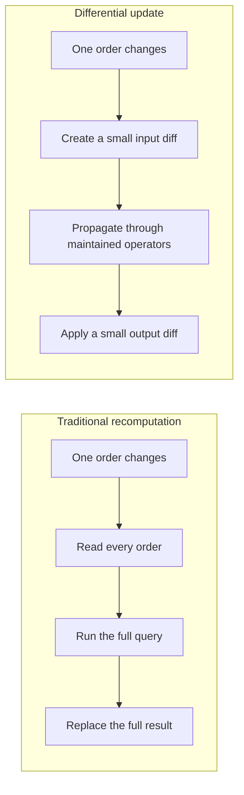

The important shift is that changes become data. Operators can transform, combine, index, persist, and transmit them.

## 2. Collections are weighted multisets

A differential collection is a **multiset**. A record may appear more than once, and an integer weight records how many copies exist.

```text
collection = {
    "apple": 2,   // two copies
    "pear":  1    // one copy
}

change = {
    "apple": -1,  // retract one copy
    "pear":  +2   // insert two copies
}

newCollection = consolidate(collection + change)
// {"apple": 1, "pear": 3}
```

Positive weights insert occurrences. Negative weights retract them. Zero-weight records are absent and can be discarded.

An update to a row is represented as a retraction followed by an insertion:

```text
function updateRow(oldRow, newRow):
    emit(oldRow, weight = -1)
    emit(newRow, weight = +1)
```

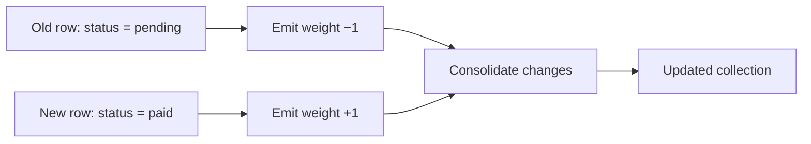

### Why negative weights are useful

If an input disappears, derived results that depended on it may also need to disappear. Negative weights let normal operator logic propagate the removal. The engine does not need separate “undo join” or “undo aggregate” APIs.

```text
// A paid order is cancelled.
inputChange = [
    (paidOrder,      -1),
    (cancelledOrder, +1)
]

filterPaid(inputChange)
// The paid row continues with weight -1.
// The cancelled row is suppressed.

mapToRevenue(...)
// Emits ({customerId: "c7", amount: 30}, -1)
```

### Consolidation

Several updates for the same record may cancel one another. Consolidation adds their weights and removes zero totals.

```text
function consolidate(updates):
    sums = mapFromRecordAndTimeToInteger()

    for (record, time, weight) in updates:
        sums[record, time] += weight

    return entriesWhereWeightIsNotZero(sums)
```

## 3. Changes have logical time

A changing collection is represented by triples:

```text
(record, logicalTime, weight)
```

Logical time identifies the version of the computation affected by an update. It is not necessarily wall-clock time.

```text
updates = [
    (order42Paid,      version(10), +1),
    (order42Paid,      version(14), -1),
    (order42Cancelled, version(14), +1)
]

function collectionAt(version):
    return consolidate(
        all updates whose logicalTime <= version
    )
```

The collection at version `v` is the sum of all differences at times less than or equal to `v`.

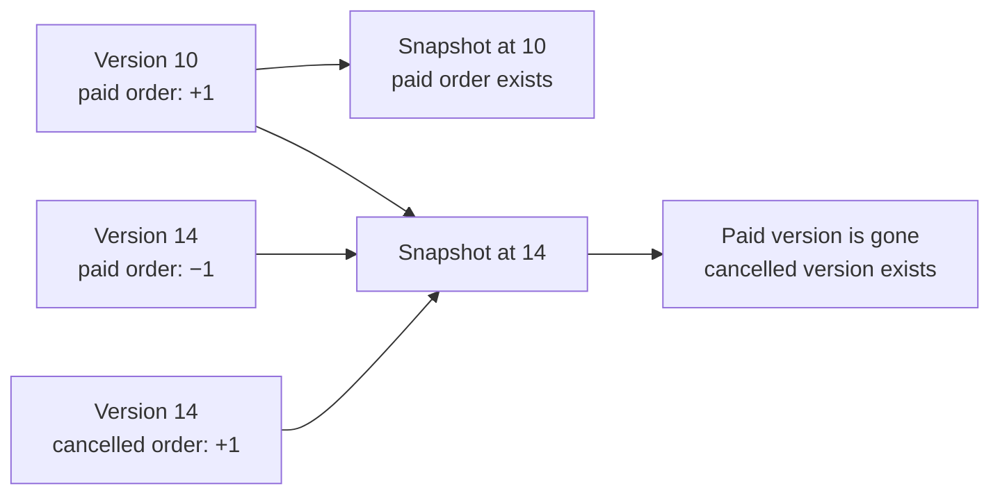

For the first version of our database, one monotonically increasing backend commit number can serve as logical time. Differential Dataflow also supports partially ordered and nested times, which become important for distributed and iterative computation.

## 4. A dataflow is a graph of incremental operators

Each operator receives weighted updates and emits weighted updates. Stateless operators process each update independently. Stateful operators also consult remembered, indexed history.

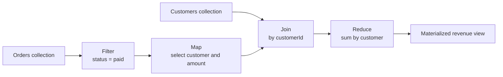

### Map and filter

Map changes the record while preserving its time and weight. Filter either forwards the whole update or suppresses it.

```text
function map(update, transform):
    (record, time, weight) = update
    emit(transform(record), time, weight)

function filter(update, predicate):
    (record, time, weight) = update

    if predicate(record):
        emit(record, time, weight)
```

Because the rules apply equally to positive and negative weights, deletions propagate automatically.

### Concatenate and negate

Concatenation merges update streams. Negation flips weights. Together they express collection subtraction.

```text
function concat(streamA, streamB):
    forward every update from A and B

function negate(update):
    (record, time, weight) = update
    emit(record, time, -weight)

A_minus_B = concat(A, negate(B))
```

## 5. Join matches keys and multiplies weights

A join combines records with matching keys. When a new update arrives on one side, the operator looks up matching history on the other side.

If a left record has weight `a` and a right record has weight `b`, the joined result has weight `a × b`.

```text
onLeftUpdate(key, leftRecord, time, leftWeight):
    for (rightRecord, rightTime, rightWeight)
        in rightIndex.lookup(key):

        outputTime = joinTimes(time, rightTime)

        emit(
            combine(leftRecord, rightRecord),
            outputTime,
            leftWeight * rightWeight
        )

// Perform the symmetric operation when a right update arrives.
```

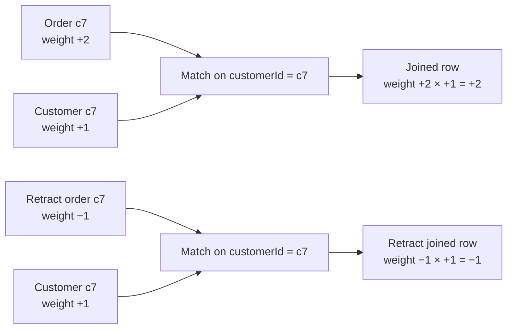

For scalar commit versions, `joinTimes(a, b)` is `max(a, b)`: the joined fact exists once both inputs exist. For partially ordered time, it is the least upper bound of the two times.

## 6. Reduce replaces a group’s old answer

Aggregates such as count, sum, minimum, and grouped lists are nonlinear. Their result cannot always be calculated from one input update alone.

A simple reducer:

1. Reads the old weighted inputs for a key.
2. Applies the new changes.
3. Calculates the new group answer.
4. Retracts the old answer.
5. Inserts the new answer.

```text
onGroupChanges(key, changes, time):
    oldInputs = inputTrace.valuesFor(key)
    oldAnswer = currentOutput[key]

    newInputs = consolidate(oldInputs + changes)
    newAnswer = sum(
        record.amount * weight
        for (record, weight) in newInputs
    )

    if oldAnswer exists:
        emit({key, total: oldAnswer}, time, -1)

    if newAnswer should exist:
        emit({key, total: newAnswer}, time, +1)

    inputTrace.replace(key, newInputs)
    currentOutput[key] = newAnswer
```

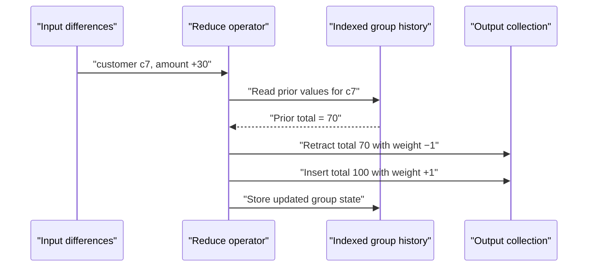

Production reducers exploit algebraic properties. Sum can update a running total directly. Minimum may maintain an ordered multiset. Distinct tracks when a record’s combined weight crosses zero.

## 7. Traces and arrangements remember indexed history

Joins and reductions need fast historical lookups. A **trace** stores updates in indexed, sorted batches. A keyed, shareable view of a trace is commonly called an **arrangement**.

```text
class Trace:
    batches = []  // immutable sorted update batches

    insertBatch(batch):
        batches.append(sortAndConsolidate(batch))
        mergeSmallBatchesInBackground()

    lookup(key, asOfTime):
        return consolidate(
            updates for key in every relevant batch
            where update.time <= asOfTime
        )
```

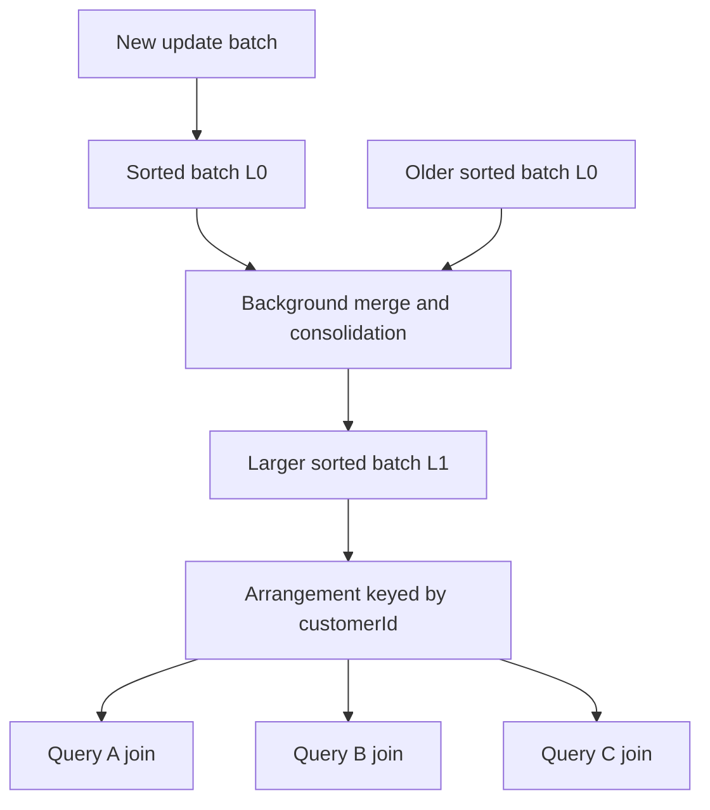

Sharing arrangements is important. Ten queries joining orders by `customerId` should reuse one maintained index instead of building ten copies.

```text
ordersByCustomer = arrange(orders, key = order.customerId)

queryA.join(ordersByCustomer)
queryB.join(ordersByCustomer)
queryC.join(ordersByCustomer)
```

## 8. Frontiers describe progress

Updates may arrive in batches or out of order. Data messages alone do not tell an operator when a logical time is complete. A **frontier** summarizes the earliest times that might still receive updates.

```text
receiveData(record, time = 12, weight = +1)
receiveData(record, time = 10, weight = -1)
receiveFrontier(13)

// No more updates with time < 13 will arrive.
// Results through version 12 are complete.
```

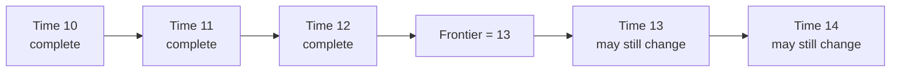

Frontiers prevent premature answers. They also provide a wire-level checkpoint: a subscriber that has received frontier `500` knows its result is complete through commit `499`.

### Why a frontier can be a set

With one ordered commit sequence, a frontier is one number. With partially ordered times, several incomparable minimal times may remain in flight. The frontier is then an **antichain**: a minimal set of times.

```text
// Scalar time
frontier = 20

// Partially ordered time: (inputA_version, inputB_version)
frontier = {(4, 9), (6, 7)}

// Neither point is earlier than the other in both coordinates.
```

General antichains are powerful but complicate scheduling, storage, and wire protocols. Our first database engine should use scalar authoritative commit versions.

## 9. Compaction forgets unobservable distinctions

A trace would grow forever if it retained every historical version. Once all readers and operators have advanced beyond a time, the engine can consolidate older updates into a coarser history.

```text
function compact(trace, sinceFrontier):
    for update in trace where update.time < sinceFrontier:
        update.time = advanceTo(update.time, sinceFrontier)

    return consolidate(trace)
```

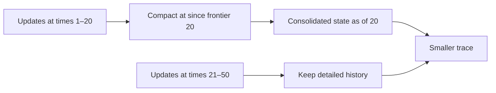

Compaction preserves answers at or after the **since frontier**, but old answers before it can no longer be reconstructed. Slow or disconnected consumers cannot pin history forever; eventually they must receive a fresh snapshot.

## 10. Iteration maintains a changing fixed point

The paper’s distinctive contribution is incremental maintenance of iterative computations. Graph and recursive queries repeatedly apply a rule until no new facts appear.

### Example: graph reachability

Given directed edges, determine which nodes are reachable from each start node:

```text
function reachability(edges):
    reachable = distinct(edges)

    repeat:
        extended = join(
            reachable by reachable.to,
            edges     by edge.from,
            emit (reachable.from, edge.to)
        )

        next = distinct(reachable + extended)
    until next == reachable

    return reachable
```

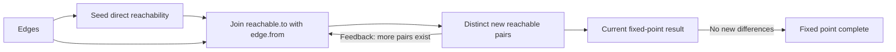

If one edge changes, differential iteration sends that weighted change through the loop. It adds or retracts only affected reachability facts and reuses the previous fixed point.

### Nested logical time

The engine must distinguish an outer database version from progress inside the loop. Conceptually, time becomes `(outerVersion, loopIteration)`.

```text
outer change arrives at commit 42

enterLoop(change):
    emit change at (42, iteration = 0)

feedback(derivedChange at (42, i)):
    emit derivedChange at (42, i + 1)

when the loop frontier proves no inner work remains:
    leaveLoop(consolidated result at commit 42)
```

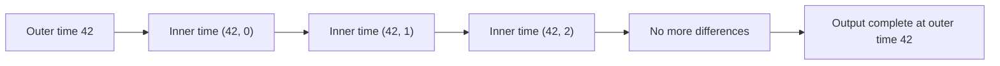

Recursive rules need deterministic, well-defined fixed-point semantics. Wall time, randomness, network calls, and mutable external state should remain outside the dataflow.

## 11. A small differential engine

The conceptual engine has five responsibilities:

- Represent timestamped weighted updates.
- Schedule operator work fairly.
- Maintain and share indexed traces.
- Track and propagate frontiers.
- Materialize and expose output changes.

```text
class Engine:
    operators
    workQueue
    traces
    inputFrontiers

    push(collection, updates, newFrontier):
        validateUpdatesAreAtOrBeyondCurrentFrontier(updates)
        workQueue.enqueue(collection, consolidate(updates))
        inputFrontiers[collection] = newFrontier
        runUntilQuiescent()

    runUntilQuiescent():
        while workQueue is not empty:
            (edge, batch) = workQueue.popFairly()

            for operator in edge.consumers:
                outputs = operator.onBatch(batch, traces)
                enqueue(outputs)

            propagateSafeFrontierAdvances()
            compactTracesAllowedBySinceFrontiers()
```

A production implementation adds bounded work quanta, backpressure, durable batches, recovery, canonical key encoding, memory accounting, and observability.

### Materialization

A materialized query is an installed dataflow with a retained output trace—not a function repeatedly rerun from scratch.

```text
subscribe(queryPlan, resumeAfterVersion):
    dataflow = compileOrReuse(queryPlan)

    if resumeAfterVersion is too old:
        send snapshot(dataflow.outputAt(currentVersion))
    else:
        send retainedDeltas(after = resumeAfterVersion)

    on each output batch:
        send {
            updates: batch,
            frontier: dataflow.outputFrontier
        }
```

## 12. Mapping the model to our HyDB

The same dataflow runtime can run in the frontend and backend:

- The frontend materializes queries over its local cache for immediate results.
- The backend materializes authorized queries over authoritative collections.
- The wire carries snapshots, weighted deltas, and progress frontiers.
- Shared transactors create optimistic frontend changes and authoritative backend commits.

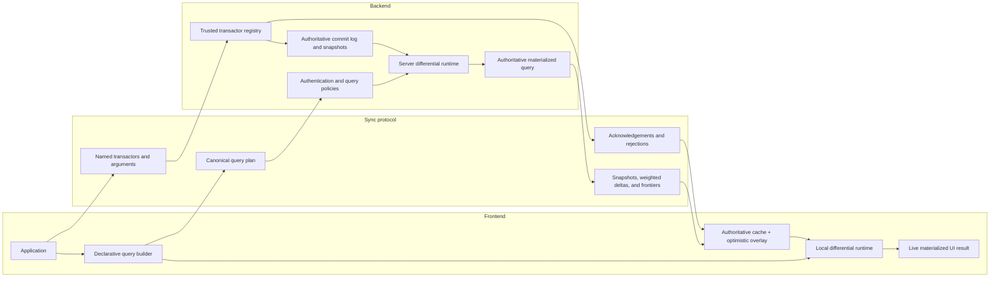

### One query plan, three placements

```text
query = orders
    .where(order.status == variable("status"))
    .join(customers, order.customerId == customer.id)
    .orderBy(order.createdAt, "desc")
    .limit(20)
```

The canonical serializable plan can run in three ways:

1. **Local:** Materialize from cached base collections.
2. **Remote:** Materialize on the backend and send output deltas.
3. **Hybrid:** Show the cached local answer immediately, run the authorized plan remotely, and reconcile toward the authoritative result.

### Optimistic writes are a provisional overlay

Pending frontend mutations should not receive fake authoritative commit numbers. Keep them in an ordered provisional overlay. When authoritative commits, acknowledgements, or rejections arrive, remove resolved mutations and replay the remaining ones.

```text
authoritativeBase = applyServerDeltas(
    authoritativeBase,
    message.deltas
)

if message acknowledges mutationId:
    pending.remove(mutationId)

if message rejects mutationId:
    pending.remove(mutationId)
    reportError(message.reason)

visibleState = authoritativeBase

for mutation in pending in clientSequenceOrder:
    visibleState = runSharedTransactor(visibleState, mutation)

frontendDataflows.apply(
    diff(previousVisibleState, visibleState)
)
```

The frontend transactor is a latency optimization, not a security boundary. The backend validates arguments, authorization, and version compatibility before committing anything.

## 13. What Differential Dataflow does not solve

Differential Dataflow gives us:

- Composable incremental semantics for inserts, deletes, joins, aggregates, and iteration.
- Progress tracking that identifies complete logical versions.
- Indexed historical state with principled compaction.
- A natural snapshot-plus-delta model for live materialized queries.

It does **not** choose these policies for us:

- Transaction isolation and durability.
- Authentication and authorization.
- Schema migration.
- Replication consensus.
- Conflict resolution.
- Query resource limits.

It also does not make every query cheap. A large join or ordered result can still require substantial maintained state. Nor does it make arbitrary JavaScript deterministic or serializable; query and transactor APIs need constrained, versioned contracts.

## 14. The whole idea in twelve lines

```text
1.  Represent each collection as weighted records.
2.  Represent change as positive and negative weights.
3.  Attach a logical version to every change.
4.  Let map and filter transform changes independently.
5.  Let joins multiply weights of matching records.
6.  Let reductions retract old answers and insert new ones.
7.  Keep indexed traces for operators that need history.
8.  Use frontiers to know which logical times are complete.
9.  Compact history older than any observable time.
10. Add nested time to maintain iterative fixed points.
11. Materialize outputs by retaining their update trace.
12. Send snapshots, deltas, and progress—not full recomputations.
```

> **One-sentence summary:** Differential Dataflow turns a changing computation into algebra over timestamped differences, allowing old work to be reused through joins, aggregates, and nested iteration.

## Sources and further reading

- Frank McSherry, Derek G. Murray, Rebecca Isaacs, and Michael Isard, [Differential Dataflow](https://www.cidrdb.org/cidr2013/Papers/CIDR13_Paper111.pdf), CIDR 2013.
- [Official Differential Dataflow documentation](https://timelydataflow.github.io/differential-dataflow/).
- [Official Timely Dataflow documentation](https://timelydataflow.github.io/timely-dataflow/), covering logical time, progress, frontiers, and nested scopes.
- Materialize, [Building Differential Dataflow from Scratch](https://materialize.com/blog/differential-from-scratch/).

The pseudocode and diagrams in this guide are explanatory rather than production implementations.
