# HyDB Query Compilation Walkthrough

This document shows how an application-facing HyDB selection becomes an
incremental execution plan. It is a design reference for implementing the query
compiler, planner, differential engine, and nested result assembler.

The examples intentionally separate three different questions:

1. **Selection IR:** What nested result did the application request?
2. **Relational IR:** What mathematical computation produces the underlying
   relations?
3. **Execution Plan:** In what order does this runtime probe maintained state and
   install incremental operators?

## Compilation pipeline

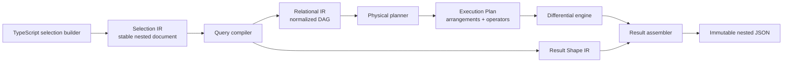

The representations have deliberately different stability requirements:

- **Selection IR** is stable and serializable. Queries, policies, and replica
  selections can retain it across processes and deployments.
- **Relational IR** is internal compiler output. It has stable semantics but does
  not need permanent wire-format compatibility.
- **Result Shape IR** records aliases, nested cardinality, hidden identity, and
  assembly rules separately from relational computation.
- **Execution Plans** are runtime-specific and may change whenever indexes,
  arrangements, cost information, or engine implementations change.

## Graph conventions

- A **relation** node in Relational IR denotes a logical input. It does not mean
  the runtime will scan every row.
- An **arrangement** is an already-maintained, shared index. It is available
  before a query instance is installed.
- Solid arrows in an Execution Plan show runtime data dependencies and therefore
  execution order.
- Dotted arrows show an arrangement being probed. The arrangement exists already;
  it does not independently execute the query.
- After installation, changed rows can enter through maintained arrangements and
  propagate through the installed operators. Joins still gate output using the
  maintained membership of the other input.

## Example 1: Household projects

The query returns projects for one household, their incomplete tasks, and each
task's optional assignee.

### TypeScript selection

```ts
const projects = db.query((q, $) =>
  q
    .from(t.projects)
    .where((project) => project.householdId.eq($.householdId))
    .select((project) => ({
      id: project.id,
      name: project.name,
      openTasks: q
        .many(project.tasks)
        .where((task) => task.completed.eq(false))
        .orderBy((task) => [task.dueAt.asc(), task.id.asc()])
        .select((task) => ({
          id: task.id,
          title: task.title,
          assignee: q.optional(task.assignee).select(userSummary),
        })),
    })),
);
```

The callback constructs typed Selection IR. No JavaScript callback survives
compilation.

### Selection IR

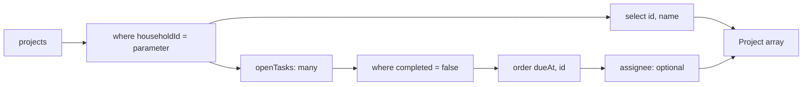

Selection IR preserves:

- the household parameter;
- aliases such as <code>openTasks</code>;
- one, optional-one, and many cardinality;
- deterministic child ordering;
- the requested nested JSON shape.

### Relational IR

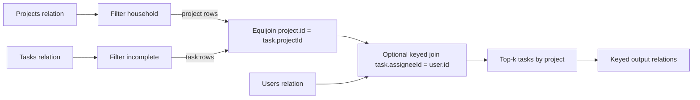

These are mathematical relation operators, not physical access instructions.
The compiler decorrelates the nested selections into keyed relations. Result
Shape IR separately records that task rows are collected beneath their project
and assignee rows become an object or <code>null</code>.

### Execution Plan

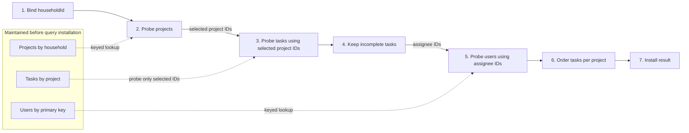

The task and user arrangements already exist, but the query does not enumerate
them. It probes tasks only after obtaining selected project IDs, then probes users
only after obtaining assignee IDs.

If a required arrangement does not exist, the planner may:

1. reuse a compatible declared index;
2. build a shared arrangement once from durable state;
3. emit a diagnostic or reject the plan under a restrictive resource policy.

It must not silently rescan an entire large table every time the query executes.

### Processing a live update

After installation, completing one task enters through the maintained task
arrangement. The selected-project relation is already maintained, so the join can
immediately determine whether that task belongs to this result.

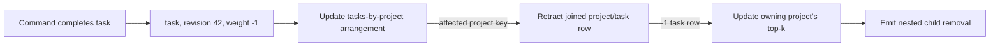

An optimistic rollback injects the additive inverse of the predicted input
changes and follows the same path.

### Result assembly

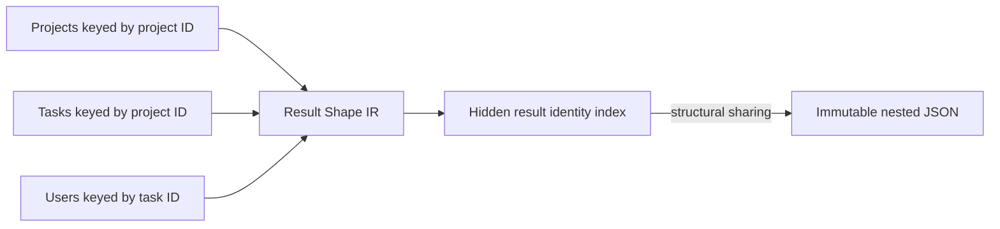

Primary keys and ordering tuples may remain hidden maintenance fields even when
the application does not select them. They allow one nested array to change
without rebuilding unrelated projects.

## Example 2: Budget dashboard

The query returns accounts, monthly spending per account, and the five most
recent monthly transactions under each account.

### TypeScript selection

```ts
const accounts = db.query((q, $) =>
  q
    .from(t.accounts)
    .where((account) => account.ownerId.eq($.ownerId))
    .select((account) => {
      const monthly = q
        .many(account.transactions)
        .where((transaction) =>
          transaction.occurredAt.between($.monthStart, $.monthEnd),
        );

      return {
        id: account.id,
        name: account.name,
        spent: monthly.sum((transaction) => transaction.amount),
        recent: monthly
          .orderBy((transaction) => [
            transaction.occurredAt.desc(),
            transaction.id.desc(),
          ])
          .limit(5)
          .select(transactionSummary),
      };
    }),
);
```

The local <code>monthly</code> value names a reusable authoring subexpression.
It does not become a closure in persisted IR.

### Selection IR

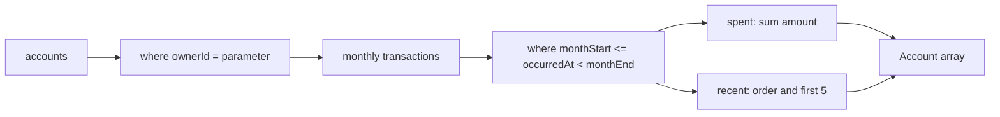

### Relational IR

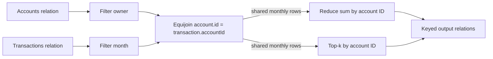

The normalized DAG preserves the shared monthly relation. The engine should not
independently filter and index the same transactions for the aggregate and child
list branches.

### Execution Plan

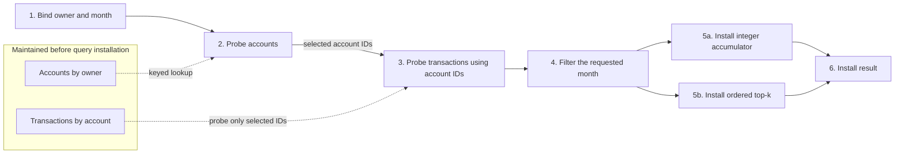

### Processing a live update

One new transaction can update both derived branches.

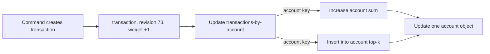

Integer minor units keep optimistic and authoritative arithmetic exact.

### Result assembly

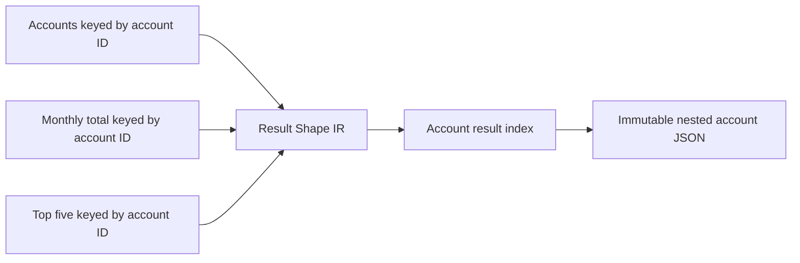

## Example 3: Inbox page

This is a one-shot keyset page rather than a live top-k subscription. It returns
unread messages, each sender, many-to-many labels, and page metadata.

### TypeScript selection

```ts
const inboxPage = db.query((q, $) =>
  q.page(
    q
      .from(t.messages)
      .where((message) =>
        message.ownerId.eq($.ownerId).and(message.read.eq(false)),
      )
      .orderBy((message) => [message.receivedAt.desc(), message.id.desc()])
      .after($.after)
      .first(25)
      .select((message) => ({
        id: message.id,
        subject: message.subject,
        sender: q.one(message.sender).select(userSummary),
        labels: q.many(message.labels).select(labelSummary),
      })),
  ),
);
```

### Selection IR

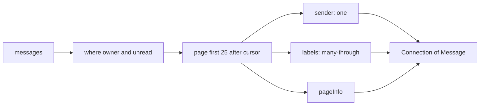

The ordering tuple must include a unique tie-breaker. The opaque cursor contains
the complete tuple, here <code>(receivedAt, messageId)</code>.

### Relational IR

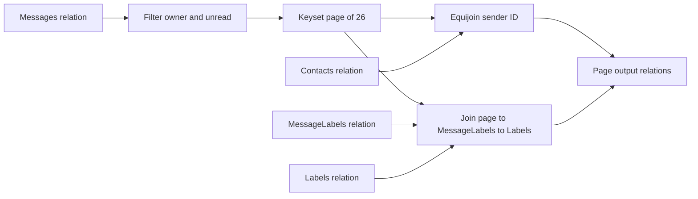

The root reads 26 records so the assembler can return 25 and determine
<code>hasNextPage</code>. Bounding the root before relationship traversal avoids
fetching sender and label data for messages outside the page.

### Execution Plan

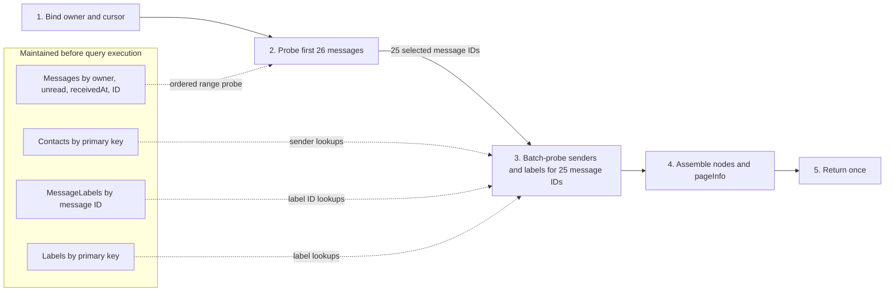

Unlike a live top-k query, this page is not installed as a subscription. Newer
messages arriving ahead of the cursor do not mutate a page the caller already
received.

### Result assembly

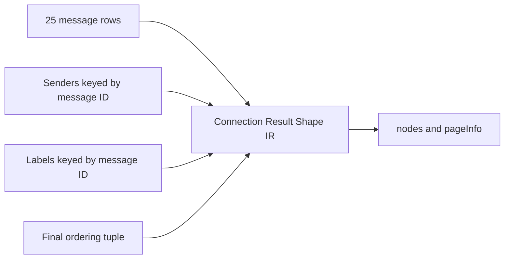

## Execution invariants

Implementations must preserve these invariants:

1. **Logical sources are not scans.** Relational IR names relations; only an
   Execution Plan chooses scans, range reads, or arrangement probes.
2. **Nested selection is compiled.** The differential engine operates on flat
   keyed collections. Result Shape IR assembles those relations into nested
   values.
3. **Relationship traversal is keyed.** Once parent IDs are available, child
   relations are probed using declared relationship keys.
4. **Arrangements are shared and continuously maintained.** Query execution
   consumes them; it does not rebuild a private index for every query.
5. **Initial installation has explicit dependencies.** A child probe cannot run
   until its parent keys arrive.
6. **Live propagation is incremental.** After installation, a changed child row
   may enter through its arrangement and join against already-maintained parent
   membership.
7. **Output is revision-atomic.** Subscribers observe a new nested result only
   after every operator affected by a revision has drained.
8. **Hidden identity is retained.** Primary keys, group keys, and complete
   ordering tuples remain available for result maintenance even if omitted from
   returned JSON.
9. **Pages and live top-k are distinct.** A keyset page is a one-shot bounded
   read. A live top-k is continuously maintained.
10. **Derived query state is rebuildable.** Arrangements and materializations are
    not the authoritative command log or synchronization history.

## Minimum implementation seams

The walkthrough implies four deep modules:

```mermaid
flowchart LR
    Selection["Selection IR"]
    Compiler["Query compiler"]
    Relational["Relational IR + Result Shape IR"]
    Planner["Physical planner"]
    Plan["Execution Plan"]
    Engine["Differential engine"]
    Changes["Keyed weighted changes"]
    Assembler["Result assembler"]
    Result["Nested result"]

    Selection --> Compiler
    Compiler --> Relational
    Relational --> Planner
    Planner --> Plan
    Plan --> Engine
    Engine --> Changes
    Changes --> Assembler
    Relational -. "shape description" .-> Assembler
    Assembler --> Result
```

Suggested interfaces:

```ts
type CompiledQuery = {
  relational: RelationalIR;
  resultShape: ResultShapeIR;
  dependencies: QueryDependencies;
  diagnostics: QueryDiagnostic[];
};

function compile(selection: SelectionIR, schema: SchemaIR): CompiledQuery;

function plan(
  relational: RelationalIR,
  schema: SchemaIR,
  catalog: ArrangementCatalog,
): {
  dataflow: PhysicalDataflowPlan;
  requirements: PlanRequirements;
  diagnostics: PlanDiagnostic[];
};
```

The compiler owns relationship lowering, correlation, hidden identity, and result
shape. The planner owns physical access, arrangement sharing, operator choice,
and execution dependencies. Callers should not need to understand either
implementation to define or run a query.
