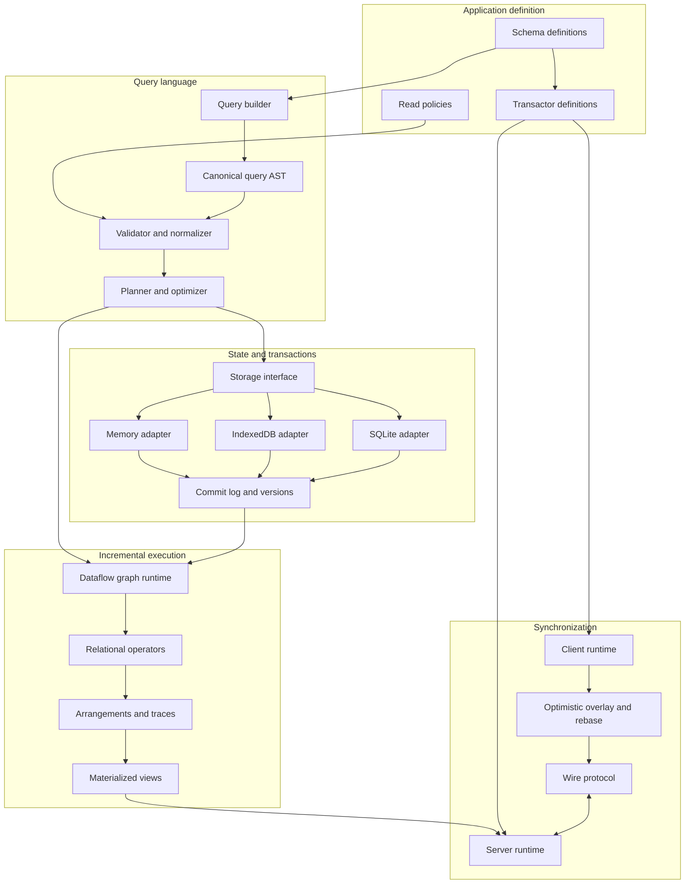
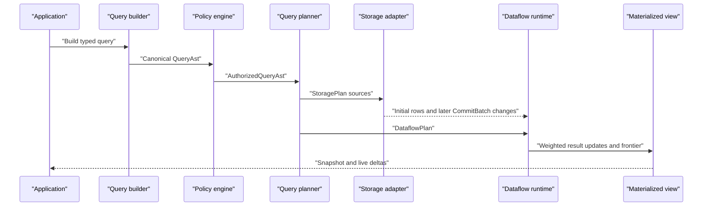
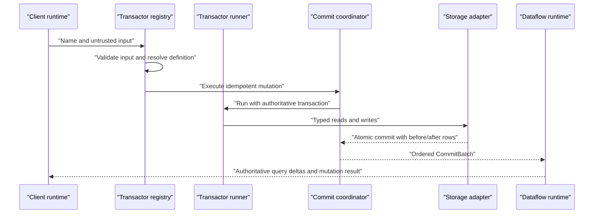
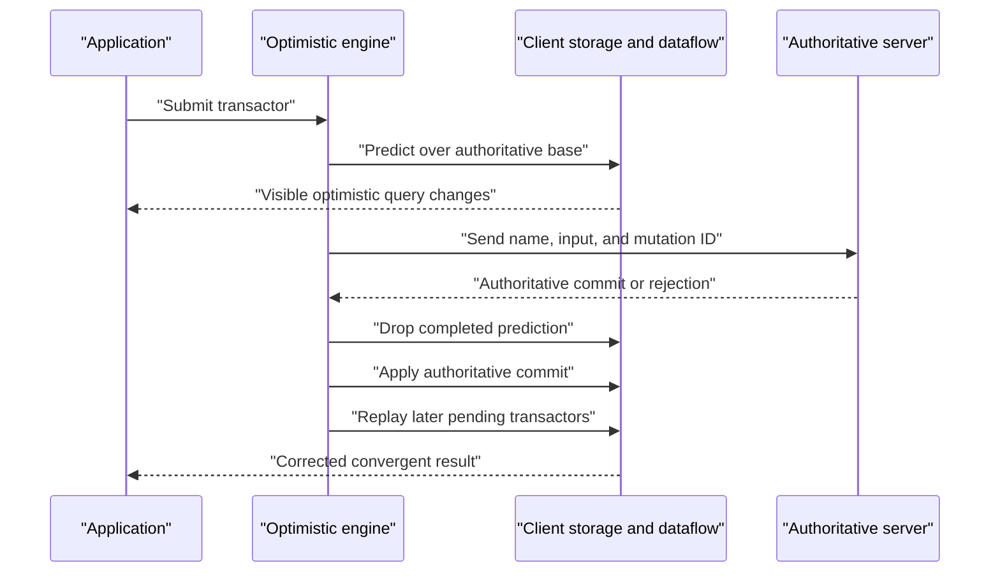

# HyDB System Components

Status: Working architecture draft

This document defines the major units HyDB will be built from, the contracts between them, and the tests that make each unit trustworthy. It complements the consumer-facing [API specification](./api-spec.md) and [application architecture](./application-architecture.md).

The goal is not to assign implementation tasks yet. It is to establish component boundaries strong enough that each subsystem can be developed, replaced, benchmarked, and tested independently.

## Architectural principles

- Consumer APIs do not expose storage, synchronization, or differential-dataflow details.
- Every boundary uses a canonical, serializable data structure rather than executable callbacks.
- The in-memory implementation is the semantic reference for queries, transactions, and adapters.
- Durable adapters pass one shared conformance suite.
- Differential operators are tested against full recomputation, not only hand-written examples.
- Backend commits are totally ordered in the first release.
- Optimistic state is a removable overlay; authoritative storage never contains predictions.
- Components depend downward through interfaces, not sideways through implementation details.

## Layer map



## Core data contracts

Several canonical types connect otherwise independent components.

### Row identity

```ts
type TableId = string
type ColumnId = string
type EncodedKey = Uint8Array
type EncodedRow = Uint8Array
```

The schema codec owns canonical encoding. Storage adapters and dataflow arrangements must not invent incompatible key representations.

### Authoritative row change

```ts
type RowChange = {
  table: TableId
  key: EncodedKey
  before: EncodedRow | null
  after: EncodedRow | null
}
```

Application operations map naturally to this representation:

```text
insert   before = null,    after = new row
update   before = old row, after = new row
delete   before = old row, after = null
```

Differential input adapters translate a `RowChange` into weighted rows internally:

```text
before != null  → emit old row with weight -1
after  != null  → emit new row with weight +1
```

### Commit batch

```ts
type CommitVersion = bigint

type CommitBatch = {
  version: CommitVersion
  mutationId?: string
  changes: readonly RowChange[]
}
```

The authoritative backend assigns a strictly increasing version to each successful commit. A batch is atomic: consumers observe all its changes or none of them.

### Differential update

```ts
type Difference = bigint

type DataflowUpdate<Row> = {
  row: Row
  version: CommitVersion
  difference: Difference
}
```

Differences are signed integers. The consumer write API never accepts them directly.

## Component catalog

## 1. Schema definition and registry

### Responsibility

The schema package implements Drizzle-style table, column, index, enum, foreign-key, and relation definitions. The registry discovers exported definitions passed to `hydb.database` and creates one immutable database schema.

### Inputs and outputs

```ts
type SchemaModule = Record<string, unknown>

interface SchemaRegistry {
  tables: ReadonlyMap<TableId, TableDefinition>
  relations: ReadonlyMap<string, RelationDefinition>
  enums: ReadonlyMap<string, EnumDefinition>
  version: number
  hash: string
}
```

### Owned behavior

- Column type inference and nullability.
- Insert, update, and row type inference.
- Primary, unique, foreign-key, and index metadata.
- Relation validation.
- Duplicate-name detection.
- Canonical schema manifest and hash generation.

### Tests

- Type tests for inferred row, insert, and update shapes.
- Runtime tests for modifiers, defaults, indexes, and references.
- Rejection tests for duplicate names, invalid references, and cycles that cannot be resolved.
- Golden tests proving equivalent module export order produces the same hash.
- Compatibility tests for additive and breaking schema changes.

## 2. Schema codec

### Responsibility

The codec converts typed values, primary keys, and rows into canonical binary or structured representations shared by storage, dataflow, and synchronization.

### Interface

```ts
interface SchemaCodec {
  encodeKey(table: TableDefinition, key: unknown): EncodedKey
  decodeKey(table: TableDefinition, key: EncodedKey): unknown

  encodeRow(table: TableDefinition, row: unknown): EncodedRow
  decodeRow(table: TableDefinition, row: EncodedRow): unknown

  compareKeys(a: EncodedKey, b: EncodedKey): number
}
```

### Tests

- Round-trip tests for every supported column type.
- Canonicalization tests: equivalent values always encode identically.
- Ordering tests for numbers, strings, compound indexes, nulls, and dates.
- Property tests over randomly generated rows.
- Cross-runtime fixtures proving browser and Node encoders produce identical bytes.

## 3. Query builder

### Responsibility

The query builder provides the typed consumer API and produces a query AST. It performs no reads and executes no user callback as part of query evaluation.

### Example

```ts
const query = db
  .query(tasks)
  .where(tasks.projectId.eq(projectId))
  .where(tasks.status.ne('done'))
  .include(tasks.assignee)
  .orderBy(tasks.priority.desc())
  .limit(50)
```

### Output

```ts
type QueryAst = {
  root: RelationalExpression
  parameters: readonly QueryParameter[]
  resultShape: ResultShape
}
```

The AST contains only branded schema references, literals, variables, expressions, and relational operations. It contains no closures or arbitrary JavaScript functions.

### Tests

- Compile-time tests for valid and invalid column comparisons.
- Snapshot tests for canonical AST output.
- Tests proving captured runtime values become literals or variables, never executable code.
- Tests for filters, projections, joins, relations, grouping, sorting, and limits.
- Canonical-plan tests proving equivalent builder calls share one identity.

## 4. Query AST validator and normalizer

### Responsibility

The validator treats every received query as untrusted input. It verifies the AST against the schema and rewrites semantically equivalent expressions into a canonical form.

### Interface

```ts
interface QueryValidator {
  validate(
    input: unknown,
    schema: SchemaRegistry,
  ): ValidatedQueryAst

  normalize(query: ValidatedQueryAst): NormalizedQueryAst
}
```

### Owned behavior

- Schema reference resolution.
- Operator and type validation.
- Parameter validation.
- Limit and complexity bounds.
- Canonical ordering of commutative expressions where safe.
- Removal of redundant projections and filters.
- Stable query identity hashing.

### Tests

- Fuzz tests against malformed and adversarial AST input.
- Type mismatch and unknown-schema-reference tests.
- Complexity-limit tests.
- Idempotence: normalizing twice equals normalizing once.
- Stable hash fixtures.

## 5. Read-policy rewriter

### Responsibility

The policy engine restricts frontend-created queries before planning. It injects mandatory predicates and rejects operations that cannot be made safe.

### Interface

```ts
interface QueryPolicyEngine<Auth> {
  authorize(
    query: NormalizedQueryAst,
    auth: Auth,
    schema: SchemaRegistry,
  ): AuthorizedQueryAst
}
```

### Invariant

No client query reaches the planner or storage adapter until it has an `AuthorizedQueryAst` produced by the backend policy engine.

### Tests

- Row-policy injection tests.
- Join tests proving restricted tables cannot leak through another relation.
- Projection tests for forbidden columns.
- Property tests comparing rewritten results to an explicit security-filter reference query.
- Tests proving authorization context affects query identity and cache sharing safely.

## 6. Query planner and optimizer

### Responsibility

The planner converts an authorized relational query into an executable plan split between storage access and incremental relational operators.

### Important boundary

Storage adapters do not receive the full consumer `QueryAst`. They receive a normalized `StoragePlan` containing operations the adapter contract can execute consistently, such as table scans, primary-key lookups, index ranges, projections, and bounded ordering.

Joins, aggregates, relation shaping, and live maintenance remain the responsibility of the planner and dataflow engine unless an adapter capability explicitly supports a verified pushdown.

### Output

```ts
type PhysicalQueryPlan = {
  sources: readonly StoragePlan[]
  dataflow: DataflowPlan
  output: ResultShape
  dependencies: readonly TableId[]
  identity: string
}
```

```ts
type StoragePlan =
  | PrimaryKeyLookup
  | IndexRangeScan
  | TableScan
```

### Owned behavior

- Predicate and projection pushdown.
- Index selection.
- Join ordering.
- Arrangement selection and reuse.
- Operator fusion where semantics are preserved.
- Top-k planning for ordered limits.
- Explain-plan output.

### Tests

- Golden physical-plan tests.
- Equivalence tests comparing optimized and unoptimized execution.
- Cost-model tests with synthetic statistics.
- Tests for index selection and fallback table scans.
- Plan-capability tests across different storage adapters.

## 7. Storage interface

### Responsibility

The storage interface defines atomic row storage, indexed reads, snapshots, commits, and change replay without depending on SQLite, IndexedDB, or memory-specific APIs.

### Interface

```ts
interface StorageAdapter {
  readonly capabilities: StorageCapabilities

  open(options: StorageOpenOptions): Promise<StorageConnection>
}

interface StorageConnection {
  read<T>(
    snapshot: StorageSnapshot,
    plan: StoragePlan,
  ): AsyncIterable<T>

  snapshot(
    version?: CommitVersion,
  ): Promise<StorageSnapshot>

  transact<T>(
    operation: (tx: StorageTransaction) => Promise<T>,
  ): Promise<StorageCommit<T>>

  changes(
    after: CommitVersion,
  ): AsyncIterable<CommitBatch>

  close(): Promise<void>
}

interface StorageTransaction {
  get(table: TableId, key: EncodedKey): Promise<EncodedRow | null>
  scan(plan: StoragePlan): AsyncIterable<EncodedRow>
  insert(table: TableId, key: EncodedKey, row: EncodedRow): Promise<void>
  update(table: TableId, key: EncodedKey, row: EncodedRow): Promise<void>
  delete(table: TableId, key: EncodedKey): Promise<void>
}
```

### Required semantics

- Atomic commits.
- Snapshot-consistent reads.
- Primary-key uniqueness.
- Declared unique-index enforcement.
- Foreign-key enforcement or a shared validation layer with identical behavior.
- Total commit ordering for authoritative adapters.
- Replayable `CommitBatch` history within a documented retention window.
- Deterministic error codes across adapters.

### Adapter conformance suite

Every adapter runs the same tests:

- Insert, read, update, and delete behavior.
- Atomic rollback after errors.
- Snapshot isolation fixtures.
- Primary, unique, and foreign-key constraints.
- Index range boundaries and ordering.
- Commit version monotonicity.
- Change replay and retention boundaries.
- Crash/reopen recovery where the platform supports durability.
- Concurrent transaction conflict behavior.

## 8. In-memory storage adapter

### Responsibility

The memory adapter is the first implementation and semantic reference. It supports tests, examples, benchmarks, and the initial end-to-end slice.

### Design

- Persistent immutable maps or copy-on-write indexes per committed version.
- One serialized authoritative writer.
- Ordered in-memory commit log.
- Exact implementation of every required storage invariant.

### Tests

The memory adapter must pass the complete storage conformance suite. Its simple implementation is also used as the oracle for randomized SQLite and IndexedDB adapter tests.

## 9. IndexedDB storage adapter

### Responsibility

The IndexedDB adapter persists the browser’s authoritative cache, pending mutation queue, query metadata, and resume cursors.

It is not an authoritative multi-user database. Server commit versions are stored exactly as received.

### Internal stores

```text
rows                 canonical rows keyed by table and primary key
indexes              derived secondary-index entries
pending-mutations    ordered optimistic mutation records
query-metadata       subscriptions, coverage, and frontiers
sync-metadata        server version, schema hash, and resume cursor
```

### Tests

- Shared storage conformance tests adapted to client-cache semantics.
- Browser tests using real IndexedDB rather than only mocks.
- Transaction abort and quota-error tests.
- Close/reopen persistence tests.
- Schema namespace and user-account isolation tests.
- Multi-tab ownership and recovery tests once that behavior is selected.

## 10. SQLite storage adapter

### Responsibility

The SQLite adapter is the first durable authoritative backend. It maps schema definitions and storage plans onto SQLite tables, indexes, transactions, and ordered commit metadata.

### Translation layer

```ts
interface SqliteCompiler {
  compileSchema(schema: SchemaRegistry): SqliteMigrationModel
  compileRead(plan: StoragePlan): CompiledSql
  bind(plan: StoragePlan): readonly SqliteValue[]
}
```

The compiler accepts only validated `StoragePlan` objects. It never parses consumer query strings.

### Tests

- Complete storage conformance suite.
- SQL golden tests for each storage-plan variant.
- Binding tests preventing SQL injection through literals.
- Real SQLite integration tests for transactions and constraints.
- Restart and commit-log recovery tests.
- Differential randomized tests against the memory adapter.

## 11. Transaction coordinator and commit log

### Responsibility

The coordinator executes an authoritative transactor inside one storage transaction, assigns its commit version, captures row changes, and publishes one atomic `CommitBatch`.

### Interface

```ts
interface CommitCoordinator {
  execute<Input, Output>(options: {
    mutationId?: string
    operation: (
      tx: AuthoritativeTransaction,
    ) => Promise<Output>
  }): Promise<{
    output: Output
    commit: CommitBatch
  }>
}
```

### Invariants

- Rejected transactors do not allocate visible commits.
- A successful transactor produces exactly one ordered commit batch.
- Row changes contain correct before and after values.
- Duplicate client mutation IDs are idempotent.
- Publishing cannot expose a commit before it is durable.

### Tests

- Multi-row atomicity and rollback tests.
- Idempotent mutation retry tests.
- Commit ordering under concurrency.
- Before/after capture tests.
- Simulated crash tests around persistence and publication boundaries.

## 12. Transactor definition registry

### Responsibility

The registry discovers `hydb.transactor` definitions, validates unique wire names, binds input validators, and produces a compatibility manifest.

### Interface

```ts
interface TransactorRegistry {
  resolve(name: string): TransactorDefinition
  validate(name: string, input: unknown): ValidatedInput
  manifest(): TransactorManifest
}
```

### Tests

- Standard Schema validator integration tests.
- Type inference tests for transactor inputs.
- Duplicate and missing name tests.
- Stable manifest and hash tests.
- Compatibility fixtures across transactor changes.

## 13. Shared transactor runtime

### Responsibility

The runtime executes one transactor definition against an abstract transaction. The same runner is used for client prediction, authoritative server execution, memory tests, and backend jobs.

### Interface

```ts
interface TransactorRunner {
  run<Input>(options: {
    definition: TransactorDefinition<Input>
    input: Input
    transaction: HyDBTransaction
    context: TransactorExecutionContext
  }): Promise<TransactorRunResult>
}
```

### Owned behavior

- Input validation.
- Stable `tx.now` and auth context.
- Read-your-writes behavior.
- Typed insert, update, and delete operations.
- Expected `hydb.error` serialization.
- Unknown local-read propagation.
- Determinism diagnostics in development.

### Tests

- Run identical fixtures against client, server, and memory transactions.
- Read-after-write tests.
- Unknown local-read tests yielding `not-predicted`.
- Expected and unexpected error handling.
- Deterministic clock fixtures.

## 14. Dataflow plan and graph builder

### Responsibility

The graph builder turns a `DataflowPlan` into a connected graph of incremental operators with typed input/output shapes.

### Interface

```ts
interface DataflowGraphBuilder {
  build(plan: DataflowPlan): DataflowGraph
}

interface DataflowGraph {
  push(batch: CommitBatch): void
  advance(frontier: CommitVersion): void
  drain(budget: WorkBudget): DataflowProgress
  dispose(): void
}
```

### Tests

- Graph topology snapshots.
- Operator input/output shape validation.
- Shared-subgraph and arrangement reuse tests.
- Disposal and resource-release tests.
- Invalid cyclic-plan rejection except for explicit future iteration scopes.

## 15. Differential operator library

### Responsibility

Each operator transforms weighted, versioned input batches and owns only the state required by its semantics.

Initial operators:

```text
source
map / project
filter
concat
negate
consolidate
distinct
join
reduce: count, sum, min, max, average
sort + top-k
```

### Operator contract

```ts
interface Operator<Input, Output> {
  onBatch(
    input: readonly DataflowUpdate<Input>[],
    context: OperatorContext,
  ): readonly DataflowUpdate<Output>[]

  onFrontier(
    frontier: CommitVersion,
    context: OperatorContext,
  ): void
}
```

### Test strategy

Every operator has three layers of tests:

1. Example tests for readable edge cases.
2. Algebraic property tests for weights, cancellation, and batching independence.
3. Randomized differential tests comparing incremental output with full query recomputation after every generated commit.

Important properties:

```text
processing batch A then B equals processing consolidated (A + B)
inserting then retracting the same input restores the original result
splitting one commit into physical batches does not change logical output
consolidated zero-weight rows never remain observable
```

## 16. Arrangements, traces, and compaction

### Responsibility

Arrangements maintain reusable keyed indexes over changing collections. Traces organize immutable update batches by key and version. Compaction merges history older than any observable frontier.

### Interface

```ts
interface Arrangement<Key, Value> {
  insert(batch: readonly DataflowUpdate<Value>[]): void

  lookup(
    key: Key,
    asOf: CommitVersion,
  ): Iterable<WeightedValue<Value>>

  compact(since: CommitVersion): void
  estimateBytes(): number
}
```

### Tests

- Lookup correctness at every retained version.
- Consolidation across batch merges.
- Compaction preservation for results at or after the since frontier.
- Shared-reference lifecycle tests.
- Memory accounting tests.
- Randomized comparison against a simple unindexed trace.

## 17. Dataflow scheduler and progress tracker

### Responsibility

The scheduler moves batches through the graph without allowing one operator or query to monopolize execution. The progress tracker advances scalar frontiers once no earlier work remains.

### Owned behavior

- Fair work queues.
- Bounded work budgets.
- Backpressure signals.
- Frontier propagation.
- Quiescence detection.
- Cancellation and graph disposal.

### Tests

- Deterministic scheduling fixtures.
- No-starvation tests with multiple active queries.
- Frontier safety: never advance past possible work.
- Eventual progress after all earlier work is drained.
- Backpressure and cancellation tests.

## 18. Materialized-view manager

### Responsibility

The manager installs, shares, snapshots, subscribes to, and disposes physical query plans. It converts weighted output updates into consumer-facing result changes.

### Interface

```ts
interface MaterializedViewManager {
  acquire(
    plan: PhysicalQueryPlan,
  ): Promise<MaterializedView>
}

interface MaterializedView {
  snapshot(): QuerySnapshot
  changes(after: CommitVersion): AsyncIterable<QueryDelta>
  release(): void
}
```

### Tests

- Initial snapshot plus subsequent delta correctness.
- Shared plan reference counting.
- Subscriber frontier behavior.
- Ordered-limit and relation-shaped result tests.
- Disposal releases operators and arrangements when no longer shared.
- Randomized comparison with direct full-query snapshots.

## 19. Optimistic overlay and rebase engine

### Responsibility

The overlay keeps authoritative client state separate from predicted mutation effects. It removes completed predictions, applies authoritative commits, and replays later pending transactors.

### State model

```text
authoritative client base
+ replay(pending transactors in client sequence order)
= visible client state
```

### Interface

```ts
interface OptimisticEngine {
  submit(mutation: PendingMutation): Promise<LocalMutationResult>

  reconcile(event: AuthoritativeMutationEvent): Promise<RebaseResult>

  visibleChanges(): AsyncIterable<VisibleChangeBatch>
}
```

### Tests

- Matching prediction produces no visible correction.
- Mismatching server result replaces the prediction.
- Rejection removes the prediction.
- Later pending transactors replay in original client order.
- A replay can become `not-predicted` without losing its server submission.
- Restart restores pending order and produces the same visible state.
- Randomized client/server simulations converge after all messages settle.

## 20. Synchronization protocol

### Responsibility

The protocol defines versioned messages for connection setup, query subscriptions, snapshots, result deltas, mutations, acknowledgements, rejections, and progress.

### Logical messages

```ts
type ClientMessage =
  | Hello
  | SubscribeQuery
  | UnsubscribeQuery
  | SubmitMutation
  | Resume

type ServerMessage =
  | Welcome
  | QuerySnapshot
  | QueryDelta
  | MutationCommitted
  | MutationRejected
  | ResyncRequired
  | ProtocolError
```

`MutationCommitted` must identify the authoritative commit needed to replace the prediction. The client cannot permanently drop the prediction until that commit’s relevant authoritative changes are available and ordered for application.

### Tests

- Codec round trips and unknown-field compatibility.
- Message size and nesting limits.
- Duplicate, delayed, reordered, and retried message simulations.
- Reconnect from retained history.
- Forced snapshot after compaction passes a resume cursor.
- Schema and transactor compatibility failures.
- Mutation acknowledgement and authoritative delta atomicity.

## 21. Client runtime

### Responsibility

The client composes IndexedDB storage, local query execution, the optimistic engine, and the sync transport into the API consumed by browser applications.

### Owned behavior

- Startup and local-state restoration.
- User and database cache namespacing.
- Query materialization and subscription lifecycle.
- Mutation submission and persistence.
- Connection and query freshness status.
- Resume, resync, and offline behavior.

### Tests

- End-to-end browser tests with real IndexedDB.
- Startup while offline.
- Disconnect during mutation submission.
- Crash/reopen pending-mutation recovery.
- Query subscription cleanup.
- User-account isolation.
- Client/server convergence simulations.

## 22. Server runtime

### Responsibility

The server composes authentication, policy rewriting, query planning, authoritative transactor execution, storage, materialized views, and protocol sessions.

### Owned behavior

- Connection authentication.
- Database compatibility handshake.
- Query authorization and resource limits.
- Mutation validation, authorization, idempotency, and execution.
- Subscription lifecycle and delta streaming.
- Commit retention and resync policy.

### Tests

- End-to-end tests against the memory and SQLite adapters.
- Multi-client query and mutation tests.
- Authorization isolation tests.
- Slow-consumer and backpressure tests.
- Retry and idempotency tests.
- Restart and subscriber-resume tests.

## 23. Framework adapters

### Responsibility

Framework packages translate the framework-neutral client primitives into idiomatic bindings without owning query or synchronization semantics.

React begins with:

```ts
DatabaseProvider
useQuery
useConnection
useMutationStatus
```

### Tests

- Hook lifecycle and cleanup tests.
- Concurrent-render safety.
- Structurally identical query deduplication.
- Suspense behavior if supported.
- Framework adapter tests run against a fake client interface, plus a small end-to-end suite against the real client.

## 24. Observability and inspection

### Responsibility

Observability exposes structured events and explain data without coupling core behavior to a logging vendor.

```ts
interface HyDBObserver {
  emit(event: HyDBEvent): void
}
```

Initial events include:

```text
query planned, installed, shared, disposed
storage scan and transaction timings
operator batch sizes and work time
arrangement sizes and compaction
mutation predicted, submitted, committed, rejected, rebased
connection, resume, resync, and protocol errors
```

Developer tools should consume the same structured events used by tests and production telemetry.

### Tests

- Event schema and redaction tests.
- No sensitive row values emitted by default.
- Explain-plan stability tests.
- Metrics do not alter scheduling or query results.

## Package and module boundaries

An initial monorepo layout could be:

```text
packages/
  schema/             definitions, registry, codec
  query/              builder, AST, validation, planning
  policy/             backend query rewriting
  storage/            adapter contracts and conformance suite
  storage-memory/     semantic reference adapter
  storage-indexeddb/  browser persistence
  storage-sqlite/     authoritative durability
  transactor/         registry and shared runner
  dataflow/           graph, scheduler, operators, arrangements
  materialize/        view manager and result shaping
  protocol/           versioned message types and codecs
  optimistic/         pending overlay and rebase
  client/             browser runtime
  server/             authoritative runtime
  react/              React integration
  testing/            generators, simulations, and test harnesses
  devtools/           explain and inspection surfaces
```

Public packages may re-export these modules through the simpler consumer names described in the API specification. Internal package boundaries exist to preserve testability, not to force consumers to install every unit manually.

## End-to-end flows

### Query installation



### Authoritative mutation



### Optimistic reconciliation



## Cross-component test strategy

### Reference semantics

The memory storage adapter and a non-incremental query interpreter form the correctness oracle. Optimized storage plans and dataflow results are continuously compared against them.

### Shared conformance suites

```text
schema codec conformance
query AST conformance
storage adapter conformance
transactor transaction conformance
dataflow operator conformance
protocol codec conformance
client/server convergence conformance
```

### Property and model-based testing

Random generators create:

- Valid schemas with keys and indexes.
- Initial table contents.
- Query plans within the supported language.
- Ordered inserts, updates, and deletes.
- Client disconnects, retries, and message reorderings.

For each generated scenario, HyDB checks:

```text
incremental query result = full recomputation result
memory adapter result = SQLite adapter result
replayed client state = uninterrupted client state
all clients converge with the server after settlement
no unauthorized row becomes observable
```

### Testing pyramid

```text
Type tests
  ↓
Pure unit and property tests
  ↓
Component conformance suites
  ↓
Adapter integration tests
  ↓
Deterministic client/server simulations
  ↓
Real browser + SQLite end-to-end tests
  ↓
Long-running randomized and failure-injection tests
```

## Initial scope boundary

The first complete system should support:

- Drizzle-style tables, primary keys, foreign keys, and secondary indexes.
- Scalar schema versions and authoritative commit versions.
- Memory, IndexedDB, and SQLite storage adapters.
- Typed filters, projection, equality joins, grouping, basic aggregates, ordering, and limits.
- Shared deterministic transactors.
- One authoritative server process and one serialized commit sequence.
- Browser optimistic overlay and deterministic rebase.
- WebSocket snapshots, query deltas, mutations, and resume.
- Framework-neutral subscriptions plus React bindings.

Initially deferred:

- Distributed authoritative workers and consensus.
- Partially ordered timestamps.
- Recursive dataflow and nested iteration.
- Arbitrary user-defined aggregate functions.
- Range and non-equality joins.
- Cross-database federation.
- Multi-region active-active writes.

## Open component decisions

- Exact canonical row and key encoding.
- Which query operations may be pushed into each storage adapter.
- Whether SQLite row changes are captured by the HyDB transaction layer or database triggers.
- How much query source data versus shaped result data the browser caches.
- Read-policy expression API and policy-aware plan sharing.
- Commit-log retention and snapshot format.
- Multi-tab ownership of IndexedDB state and pending mutations.
- Post-commit effect delivery and retry semantics.
- Rolling compatibility rules for schema and transactor changes.
